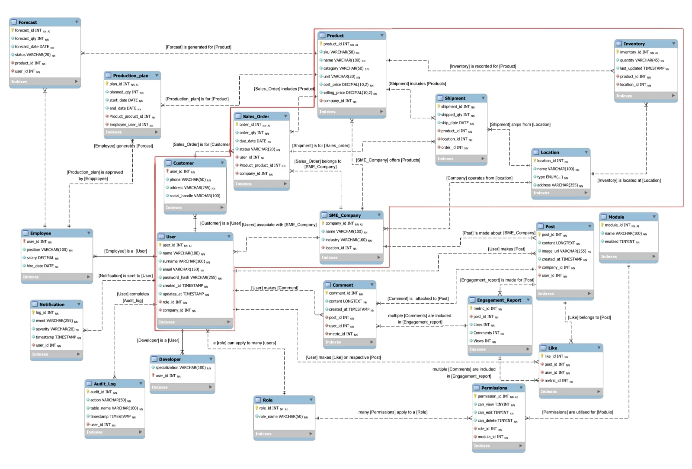

# Inventory Hub ERP System

A comprehensive web-based ERP system for inventory management, built with HTML, Bootstrap, JavaScript, and SQLite. 

A system by:

Phathu Mudau u19032936

Ndumiso Zondi u22631268

Jayden Williams u22830368 

Caleb Pillay u23528232

## Features

- **Dashboard**: Overview of key metrics, sales vs production analytics, and quick actions
- **Inventory Management**: Track and manage stock levels, categories, and inventory value
- **Sales & Marketing**: Monitor campaigns, leads, and sales performance
- **Manufacturing**: Manage production schedules, job progress, and capacity utilization
- **Logistics**: Track shipments, deliveries, and warehouse operations
- **Customer Management**: Maintain customer database and create invoices
- **Reporting**: Generate various business reports with date filtering

## Database Setup

### Using SQLite Command Line

1. Open command prompt/terminal in the project directory
2. Run the SQL commands:
   ```bash
   sqlite3 inventory_hub.db < inventory.sql
   
## Database Schema

### Entity Relationship Diagram (ERD)




## Tables

1. **User**: Central table recording all users (employees, customers, SME companies) with authentication and security details
2. **Customer**: Child table of User, recording individual customer specific details and contact information
3. **Employee**: Child table of User, recording employee specific information including position and employment details
4. **SME_Company**: Child table of User, recording client/partner companies and their business information
5. **Location**: Table recording all physical locations including warehouses, customer addresses, and supplier locations
6. **Product**: Table recording all products offered through the system with pricing, categories, and measurement units
7. **Sales_Order**: Table recording all sales orders with customer/company information, order status, and total amounts
8. **Order_Items**: Junction table linking sales orders to products with quantities and pricing
9. **Inventory**: Table tracking current inventory levels across different locations
10. **Shipment**: Table tracking and recording shipments for sales orders with status and tracking information


## Views

1. **Logistics_Dashboard**: Summary of logistics related data used to organize and coordinate logistics operations including shipments, orders, and customer information
2. **Manufacturing_Dashboard**: Summary of manufacturing information including job schedules, quantities, due dates, and progress percentages for production planning
3. **SalesMarketing_Dashboard**: Comprehensive view of sales data and performance metrics used for analysis, reporting, and business planning

## Sample Data

The database includes realistic sample data for testing:

- **4 Users**: Admin, individual customers, and SME company
- **2 Customers**: John Doe and Jane Doe with contact information
- **1 Employee**: System Administrator
- **1 SME Company**: ABC Industries in manufacturing sector
- **3 Locations**: Warehouses in Johannesburg, Cape Town, and Durban
- **3 Products**: Cream Donuts, Chocolate Chip Cookies, Whole Wheat Bread across different categories
- **2 Sales Orders**: Sample transactions with realistic amounts
- **2 Shipments**: Active shipments with tracking numbers
- **2 Manufacturing Jobs**: Scheduled and in-progress production jobs

## File Structure

```
├── index.html # Main dashboard with analytics and quick actions
├── Login.html # User authentication page
├── Register.html # User registration page
├── Inventory.html # Inventory management and tracking
├── Logistics.html # Shipment and warehouse management
├── Manufacturing.html # Production scheduling and job management
├── SalesAndMarketing.html # Campaigns and sales performance tracking
├── barChart.js # Chart.js implementation for analytics
├── inventory.sql # Complete database schema and sample data
└── README.md # This file
```


## Usage

1. Initialize the database using the SQLite command line method above
2. Open `index.html` in your web browser
3. Navigate through the different modules using the sidebar navigation
4. Use quick actions for common tasks like creating invoices or adding stock

## Technologies Used

- **HTML5**: Structure and forms across all modules
- **Bootstrap 5.3.8**: UI framework and responsive design
- **Chart.js**: Interactive charts and analytics visualization
- **SQLite**: Database for data persistence and relationships
- **JavaScript**: Client-side functionality and chart rendering (the javascript is only there for graph demonstration purposes and will be removed)

## Browser Compatibility

The application works with all modern browsers that support HTML5, CSS3, and ES6 JavaScript, including:

- Chrome 90+
- Firefox 88+
- Safari 14+
- Edge 90+

Note: This is a static HTML application. For production use, you would need to add backend functionality for database connectivity and form processing.

## References

<a href="https://www.flaticon.com/free-icons/inventory-management" title="inventory-management icons">Inventory-management icons created by Freepik - Flaticon</a>

